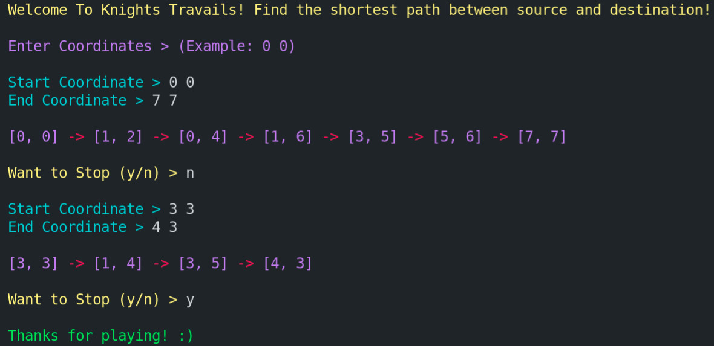

# [Knights Travails](https://www.theodinproject.com/paths/full-stack-ruby-on-rails/courses/ruby-programming/lessons/knights-travails)

  
Table Of Contents

  <ol>
    <li>
      <a href="#description">Description</a>
    </li>
    <li>
      <a href="#built-with">Built With</a>
    </li>
     <li>
      <a href="#what-i-learned">What I Learned</a>
    </li>
     <li>
      <a href="#acknowledgements">Acknowledgements</a>
    </li>
  </ol>

## Description
> A knight in chess can move to any square on the standard 8x8 chess board from any other square on the board, given enough turns. Its basic move is two steps forward and one step to the side. It can face any direction. - The Odin Project.

  My task is to write code that shows the simplest possible way to get from one square (source) to another square (destination).
  
  I used `graph` data structure to represent the board as a graph where each cell (graph vertex) is connected to the possible moves that can be taken from a `knight` in that cell. Atmost 8 places are possible moves from a cell by a knight.
  
  I used `adjacency list` to represent the `graph`.
  
  Then I used `Breadth First Search` to find the shortest path between the given `source` and the `destination`. Because In an unweighted graph, `BFS` always reach the destination with the minimum number of `edges` (connection of vertices) from the source.

## Built With
* Ruby

## What I Learned
* What is Graph
* Represenations of Graph
* Graph - BFS
  
## Acknowledgements
* [The Odin Project](https://theodinproject.com)
* [Replit](https://replit.com)

[Move To Top](#knights-travails)

